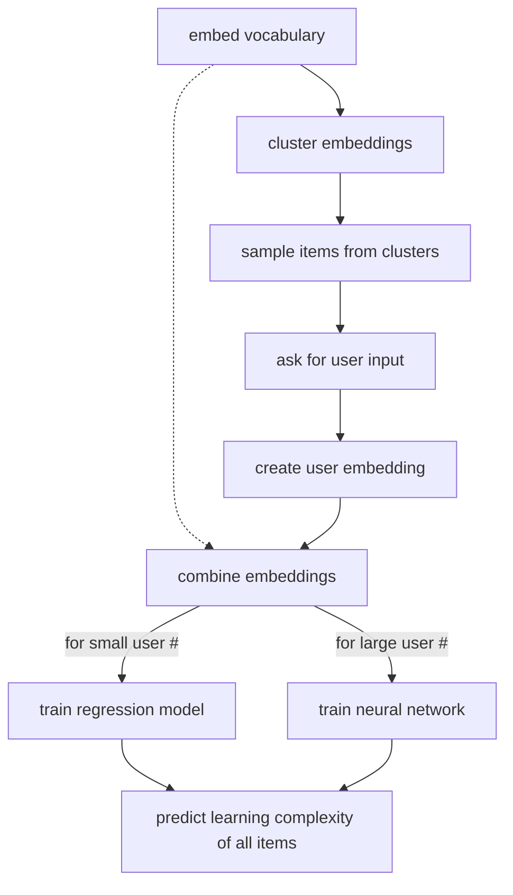

# Learning Optimiser

[documentation still in progress]

## Table of Contents
- [About the Project](about)
- [Requirements](reqs)
- [Basic Architecture](architecture)

## About the Project 

The aim of this project is to combine unsupervised and supervised ML techniques to build a more comprehensive, user-centric learning recommendation system (and hopefully outperform systems limited to tracking answer accuracy). Note: This algorithm is meant to complement rather than replace other learning methods—the intention is to offer a more tailored tool to work on self-improvement goals with memory component such as learning new languages, expanding vocabulary, or practising terminology. 

## Requirements 

### Files:

- **set of items** (this demo uses a vocabulary of 5000 word)
- **semantic embeddings** (or a pretrained model)

### Libraries:

#### For data pre-processing
- `numpy`
- `pandas`
- `pypdf` 
- `deep-translator`
- `sentence-transformers`

#### For clustering & sampling
- `numpy`
- `pandas`
- `sklearn`
- `matplotlib`
- `kneed`
- `random`

## Basic Architecture 

